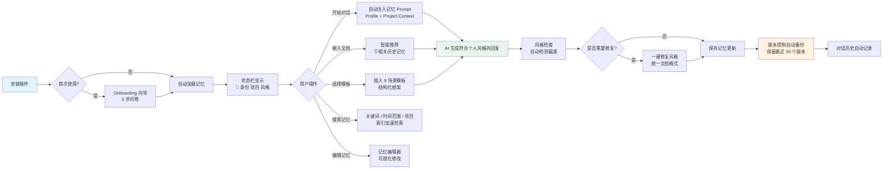

# Remember Me — Phase 3 功能演示文档

> **版本**: v0.3.0  
> **对应迭代**: 2026-07-13  
> **状态**: ✅ 全部功能已实机验证，320/320 测试通过

---

## 一、Phase 3 功能总览

| 功能模块 | 核心能力 | 状态 | 命令面板入口 |
|---------|---------|------|-------------|
| **模板系统** | 8 种专业场景模板（PRD / 商业计划书 / 论文 / 市场调研 / 活动策划 / 设计说明 / 技术方案 / 汇报材料） | ✅ 已验证 | `Remember Me: 选择模板` |
| **风格一致性检查** | 自动检测文档风格偏差，一键修复为个人习惯格式 | ✅ 已验证 | `Remember Me: 自动修复风格` |
| **智能推荐记忆** | 基于内容感知的离线关键词推荐，实时推送相关历史决策与术语 | ✅ 已验证 | 自动触发（侧边栏 / 状态栏） |
| **记忆版本控制** | 每次更新自动备份，支持版本浏览、JSON 预览与一键回滚 | ✅ 已验证 | `Remember Me: 打开版本控制` |
| **搜索索引优化 + 持久化** | 磁盘索引文件加速全文搜索，重启后索引自动恢复 | ✅ 已验证 | `Remember Me: 搜索记忆` |
| **社区模板市场 MVP** | 导入/导出 `.remember-template.json`，跨设备共享模板 | ✅ 已验证 | `Remember Me: 管理模板` |

---

## 二、核心交互流程图



---

## 三、每项功能 1 分钟上手说明

### 3.1 模板系统（8 场景）

**快捷键**: `Ctrl+Shift+P` → 输入 `Remember Me: 选择模板`

**上手步骤**:
1. 打开命令面板，选择 `Remember Me: 选择模板`
2. QuickPick 列表显示 8 个内置场景：
   - 📋 PRD（产品需求文档）
   - 💼 商业计划书
   - 🎓 学术论文
   - 📊 市场调研报告
   - 🎉 活动策划方案
   - 🎨 设计说明文档
   - ⚙️ 技术方案文档
   - 📑 汇报材料
3. 选择场景后，模板自动插入当前文档
4. 模板内容已预填充你的项目上下文和个人风格偏好

**模板管理**:
- `Remember Me: 管理模板` — 查看模板数量统计与内置/自定义分类
- `Remember Me: 导出模板` — 将当前文档保存为 `.remember-template.json`
- `Remember Me: 导入模板` — 从文件系统导入社区模板
- `Remember Me: 预览模板` — 查看模板结构而不插入
- `Remember Me: 应用模板` — 在指定位置插入模板内容

---

### 3.2 风格一致性检查

**快捷键**: `Ctrl+Shift+P` → 输入 `Remember Me: 自动修复风格`

**上手步骤**:
1. 在 Markdown 文档中右键或打开命令面板
2. 选择 `Remember Me: 自动修复风格`
3. 插件读取你的个人画像中的「做事风格」配置
4. 自动检测文档中不符合以下习惯的偏差：
   - 文档结构（如：先背景后功能 vs 先功能后背景）
   - 详细程度（简洁 / 标准 / 详尽）
   - 语言风格（中文 / 英文）
   - 特殊习惯标记（如 MoSCoW 优先级、用户旅程图缺失）
5. 一键修复或逐项确认修改

**提示**: 风格检查仅在已设置个人画像时可用。未设置时会自动跳转 Onboarding 向导。

---

### 3.3 智能推荐记忆（内容感知）

**触发方式**: 自动触发（无需手动操作）

**上手步骤**:
1. 在任意文档中输入与项目相关的内容（如 "登录功能"、"OAuth"）
2. 插件通过 `MemoryRecommender` 离线分析你的输入内容
3. 状态栏或侧边栏显示 💡 推荐图标，点击展开推荐列表
4. 推荐内容可能包括：
   - 历史项目决策（如 "已确定采用 OAuth 2.0 + SSO"）
   - 项目术语定义（如 "SSO：单点登录"）
   - 相关对话历史（如 "上周讨论过登录方案"）
5. 点击推荐项可插入到当前文档，或选择 `忽略推荐` 清除

**推荐算法特性**:
- 完全离线，零 AI 依赖
- 基于 Dice 系数的多维权重加成（同一项目 +0.2、近期内容 +0.15、已确定决策 +0.1）
- 支持中英文混合关键词提取
- 最多返回 5 条最相关记忆，按 relevanceScore 降序排列

---

### 3.4 记忆版本控制

**快捷键**: `Ctrl+Shift+P` → 输入 `Remember Me: 打开版本控制`

**上手步骤**:
1. 打开命令面板，选择 `Remember Me: 打开版本控制`
2. Webview 面板显示记忆版本历史：
   - 左侧：备份列表（按时间倒序，最近 20 个版本）
   - 中间：选中版本的 JSON 预览（只读）
   - 右侧：当前版本对比（高亮变更字段）
3. 操作按钮：
   - **回滚到此版本** — 将当前记忆恢复为选中版本，自动创建新备份
   - **查看差异** — 与当前版本逐字段对比
   - **导出备份** — 将指定版本保存为独立 JSON 文件

**自动备份时机**:
- 每次记忆编辑器保存时
- 每次 `更新个人画像` 命令执行后
- 每次项目上下文变更时

---

### 3.5 搜索索引优化 + 持久化

**快捷键**: `Ctrl+Shift+P` → 输入 `Remember Me: 搜索记忆`

**上手步骤**:
1. 打开命令面板，选择 `Remember Me: 搜索记忆`
2. 输入框支持多种查询模式：
   - 关键词搜索：直接输入 "OAuth"、"登录"
   - 时间范围：输入 `after:2026-06-01` 或 `before:2026-07-01`
   - 项目限定：输入 `project:TeamFlow` 或 `project:thesis-llm`
   - 标签过滤：输入 `tag:决策` 或 `tag:术语`
3. 结果列表即时显示，包含：
   - 记忆类型（决策 / 术语 / 对话）
   - 所属项目
   - 匹配内容片段（高亮关键词）
   - 更新时间
4. 点击结果项可直接在记忆编辑器中打开

**索引特性**:
- 首次启动时自动构建全量索引
- 索引持久化到磁盘（`~/.remember-me/search-index.json`）
- 重启后索引自动加载，无需重建
- 记忆变更时增量更新索引

---

### 3.6 社区模板市场 MVP

**快捷键**: `Ctrl+Shift+P` → 输入 `Remember Me: 管理模板`

**上手步骤**:
1. 打开命令面板，选择 `Remember Me: 管理模板`
2. 模板管理面板显示：
   - 内置模板：8 个官方场景（不可删除）
   - 自定义模板：你自己创建或导入的模板
   - 模板统计：总数、使用次数、最近更新
3. 导出模板分享：
   - 在任意文档中，选择 `Remember Me: 导出模板`
   - 填写模板名称、描述、适用场景标签
   - 生成 `.remember-template.json` 文件，可分享到社区或团队
4. 导入模板：
   - 选择 `Remember Me: 导入模板`
   - 选择 `.remember-template.json` 文件
   - 自动验证模板结构并合并到自定义模板列表

**模板文件格式示例**:
```json
{
  "name": "B端 SaaS PRD 模板",
  "version": "1.0.0",
  "author": "your-name",
  "tags": ["PRD", "B端", "SaaS"],
  "description": "适用于 B 端 SaaS 产品的需求文档模板",
  "scenes": ["prd"],
  "content": {
    "sections": [
      { "title": "背景与目标", "prompt": "描述产品背景..." },
      { "title": "用户画像", "prompt": "定义目标用户..." },
      { "title": "功能结构", "prompt": "列出功能模块..." }
    ]
  }
}
```

---

## 四、已知限制与 Roadmap

### 4.1 当前已知限制

| 限制 | 说明 | 预计解决阶段 |
|------|------|-------------|
| 语义搜索 | 当前仅支持关键词搜索，不支持基于向量相似度的语义搜索 | Phase 4 Pro 版 |
| 云端同步 | 记忆数据仅存储于本地，跨设备需手动复制 `~/.remember-me/` | Phase 4 Pro 版 |
| 团队协作 | 不支持多用户共享项目上下文或团队记忆库 | Phase 4 Pro 版 |
| 搜索索引规模 | 当前索引优化针对 1,000 条以内记忆设计，超大规模数据集需进一步优化 | Phase 4 |
| 模板市场 | MVP 仅支持本地导入/导出，无在线市场浏览与下载 | Phase 4 |
| 风格检查语言 | 当前主要优化中文与英文文档，其他语言支持有限 | 持续优化 |

### 4.2 Phase 4 展望

```
Phase 4：商业化与高级功能
├── 4.1 语义搜索（Pro 版）
│   ├── ChromaDB + all-MiniLM-L6-v2 向量索引
│   ├── 自然语言查询（"用户登录相关的讨论"）
│   └── 混合搜索：关键词 + 语义，权重融合
├── 4.2 云端同步（Pro 版）
│   ├── 端到端加密存储
│   ├── 多设备自动同步
│   └── 冲突解决策略
├── 4.3 团队协作（Pro 版）
│   ├── 共享项目上下文
│   ├── 团队记忆库
│   └── 权限管理与审计日志
├── 4.4 记忆质量分析（Pro 版）
│   ├── 记忆冗余检测
│   ├── 关键信息缺失提醒
│   └── 自动记忆归档建议
└── 4.5 付费系统接入
    ├── Pro 版订阅管理
    ├── 功能分级与试用
    └── 团队版授权
```

---

## 五、附录：命令速查表

| 命令 | 快捷键 | 功能说明 |
|------|--------|----------|
| `Remember Me: 打开设置` | `Ctrl+Shift+P` → `open settings` | 打开设置面板 |
| `Remember Me: 开始对话` | `Ctrl+Shift+P` → `start chat` | 在新文档中注入记忆 Prompt |
| `Remember Me: 切换项目` | `Ctrl+Shift+P` → `switch project` | 切换到其他项目上下文 |
| `Remember Me: 搜索记忆` | `Ctrl+Shift+P` → `search memory` | 关键词搜索历史记忆 |
| `Remember Me: 选择模板` | `Ctrl+Shift+P` → `select template` | 选择文档模板 |
| `Remember Me: 管理模板` | `Ctrl+Shift+P` → `manage templates` | 模板市场管理 |
| `Remember Me: 导出模板` | `Ctrl+Shift+P` → `export template` | 导出当前模板 |
| `Remember Me: 导入模板` | `Ctrl+Shift+P` → `import template` | 导入模板文件 |
| `Remember Me: 预览模板` | `Ctrl+Shift+P` → `preview template` | 预览模板结构 |
| `Remember Me: 应用模板` | `Ctrl+Shift+P` → `apply template` | 在文档中插入模板 |
| `Remember Me: 打开版本控制` | `Ctrl+Shift+P` → `version control` | 查看记忆版本历史 |
| `Remember Me: 自动修复风格` | `Ctrl+Shift+P` → `auto fix style` | 检查并修复风格不一致 |
| `Remember Me: 忽略推荐` | `Ctrl+Shift+P` → `ignore recommendation` | 忽略当前推荐 |
| `Remember Me: 更新个人画像` | `Ctrl+Shift+P` → `update profile` | 编辑个人画像信息 |
| `Remember Me: 打开记忆编辑器` | `Ctrl+Shift+P` → `memory editor` | 打开可视化记忆编辑面板 |
| `Remember Me: 刷新记忆` | `Ctrl+Shift+P` → `refresh memory` | 刷新记忆数据 |
| `Remember Me: 查看对话历史` | `Ctrl+Shift+P` → `conversation history` | 查看历史对话记录 |
| `Remember Me: 打开设置向导` | `Ctrl+Shift+P` → `onboarding` | 重新运行首次设置向导 |
| `Remember Me: 显示菜单` | `Ctrl+Shift+P` → `show menu` | 弹出主菜单 |
| `Remember Me: 快捷菜单` | `Ctrl+Shift+P` → `quick menu` | 弹出快捷操作菜单 |
| `Remember Me: 关于` | `Ctrl+Shift+P` → `about` | 显示插件版本信息 |

---

## 六、截图索引

> 以下截图存放于 `docs/demo/screenshots/` 目录，请参阅该目录下的 [README.md](demo/screenshots/README.md) 获取详细的截取规范与指引。

| 序号 | 截图文件 | 对应章节 | 功能说明 |
|------|----------|----------|----------|
| 01 | `01-onboarding-wizard.png` | 快速开始 | 首次使用向导：5 步问卷式设置 |
| 02 | `02-status-bar-activated.png` | 功能总览 | 状态栏记忆激活：身份、项目、风格一目了然 |
| 03 | `03-start-chat-prompt.png` | 3.1 / 3.3 | 开始对话：记忆 Prompt 自动注入 + AI 流式响应 |
| 04 | `04-template-quickpick.png` | 3.1 | 模板系统：8 个内置场景 QuickPick 选择 |
| 05 | `05-smart-recommendation.png` | 3.3 | 智能推荐记忆：💡 相关历史决策与术语推荐 |
| 06 | `06-style-check-fix.png` | 3.2 | 风格一致性检查：自动检测并修复文档偏差 |
| 07 | `07-version-control-panel.png` | 3.4 | 记忆版本控制：备份列表、JSON 预览与回滚 |
| 08 | `08-search-memory-results.png` | 3.5 | 搜索记忆：关键词高亮与多维过滤结果 |
| 09 | `09-template-market.png` | 3.6 | 社区模板市场：内置/自定义模板统计与管理 |
| 10 | `10-memory-editor.png` | 3.4 | 记忆编辑器：可视化三标签页编辑面板 |

---

<div align="center">

**⭐ Phase 3 已交付，欢迎使用并反馈！**

[提交 Issue](https://github.com/ltgkb/remember-me/issues) · [参与贡献](docs/CONTRIBUTING.md) · [查看文档](docs/)

</div>
