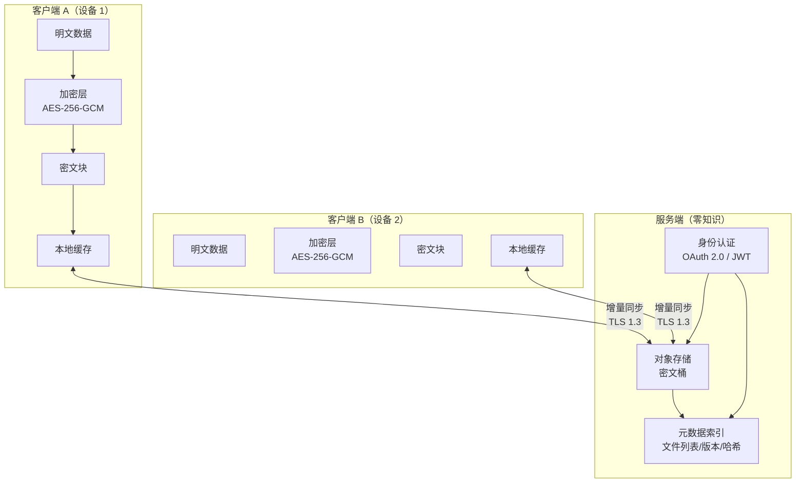
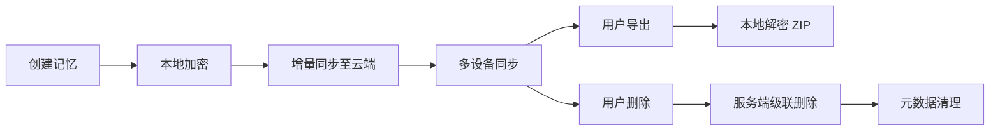

# Remember Me — 云端同步架构设计

**文档版本**: v1.0  
**日期**: 2026-07-16  
**对应需求**: PRD §4.2 云端同步 Pro 版  
**编制**: 开发团队（文档与工具工程师）

---

## 1. 设计目标

Remember Me Pro 版支持**多设备记忆同步**。核心设计原则：

1. **隐私优先**：端到端加密，服务端仅存储密文，无法解密用户数据
2. **零知识架构**：密钥本地生成、本地保管，云端不接触明文
3. **透明可控**：用户可随时导出、删除自己的全部数据
4. **高效可靠**：增量同步、冲突自动解决，支持离线编辑

---

## 2. 端到端加密

### 2.1 密钥管理

```
用户密码 / 生物识别
       │
       ▼
┌──────────────┐
│  PBKDF2 /    │  100,000+ 迭代（或 Argon2id）
│  Argon2id    │  内存硬度参数：64MB，3 次遍历
└──────┬───────┘
       │
       ▼
  主密钥 (Master Key)
       │
       ├──► 数据加密密钥 (DEK) ──► AES-256-GCM
       │
       └──► 元数据密钥 (MK)    ──► HMAC-SHA256
```

- **主密钥派生**：采用 PBKDF2（SHA-256，100,000 迭代）或 Argon2id（内存硬度 64MB，3 次遍历）
- **本地安全存储**：主密钥派生后仅存于内存，持久化使用操作系统密钥链（macOS Keychain / Windows DPAPI / Linux libsecret）
- **服务端零接触**：服务器从未收到用户密码或主密钥

### 2.2 加密粒度

**单文件级加密**，每个文件独立处理：

| 文件类型 | 加密范围 | 说明 |
|----------|----------|------|
| `profile.json` | 完整文件 | 用户画像 + 做事风格 |
| `{project}/context.json` | 完整文件 | 项目上下文 |
| `{project}/conversations/*.json` | 单文件 | 每条对话历史独立加密 |
| `search-settings.json` | 完整文件 | 搜索模式等轻量配置 |

**优势**：
- 细粒度增量同步：仅变更文件需重新上传
- 文件级版本控制：便于冲突检测与回滚
- 最小化攻击面：单文件泄露不影响其他数据

### 2.3 加密方案

**AES-256-GCM**：
- 密钥长度：256 位
- 每个文件独立 **IV（初始化向量）**：12 字节随机数，永不重复
- 认证标签（Tag）：128 位，确保完整性与真实性
- 附加认证数据（AAD）：文件路径 + 版本号，防止重放攻击

```python
import os
from cryptography.hazmat.primitives.ciphers.aead import AESGCM

def encrypt_file(plaintext: bytes, dek: bytes, filepath: str, version: int) -> bytes:
    iv = os.urandom(12)
    aad = f"{filepath}:{version}".encode()
    aesgcm = AESGCM(dek)
    ciphertext = aesgcm.encrypt(iv, plaintext, aad)
    return iv + ciphertext  # 前 12 字节为 IV

def decrypt_file(ciphertext: bytes, dek: bytes, filepath: str, version: int) -> bytes:
    iv, encrypted = ciphertext[:12], ciphertext[12:]
    aad = f"{filepath}:{version}".encode()
    aesgcm = AESGCM(dek)
    return aesgcm.decrypt(iv, encrypted, aad)
```

---

## 3. 同步协议

### 3.1 架构概览



### 3.2 冲突检测

**基于 Lamport 时间戳**：

```typescript
interface FileVersion {
  filepath: string;
  lamport: number;      // 单调递增的逻辑时钟
  deviceId: string;     // 设备唯一标识
  contentHash: string;  // SHA-256(密文内容)
  modifiedAt: string;   // ISO 8601 UTC
}
```

- **Lamport 时间戳**：`(lamport, deviceId)` 字典序比较，解决分布式时钟不同步问题
- **内容哈希**：用于检测「伪冲突」（内容相同但时间戳不同）

### 3.3 冲突解决策略

| 策略 | 适用场景 | 实现 |
|------|----------|------|
| **Last-Write-Wins（LWW）** | 默认全局策略 | Lamport 时间戳最大者获胜，自动覆盖 |
| **用户手动合并** | `profile.json`、`context.json` 等关键文件 | 检测到冲突时，UI 弹窗展示差异对比，用户选择保留 A/B/合并 |
| **追加合并** | `conversations/*.json` | 冲突时保留两版本，在对话列表中标记「多设备同步副本」 |

### 3.4 增量同步

**基于文件内容哈希分块**：

1. 客户端计算本地文件哈希树（4KB 块级 SHA-256）
2. 向服务端请求「远程文件哈希列表」
3. 对比差异，仅上传变更块
4. 服务端重组密文块，更新版本元数据

**优势**：
- 大文件（如大量对话历史）仅需传输少量变更
- 支持断点续传

---

## 4. 存储后端选型对比

| 方案 | 优点 | 缺点 | 适用场景 | 推荐阶段 |
|------|------|------|----------|----------|
| **自托管 MinIO** | 成本低、数据主权完全可控、S3 兼容 API | 运维负担、需自行保障高可用与备份 | 企业版私有化部署 | 企业版 |
| **AWS S3 + KMS** | 成熟稳定、全球 CDN、IAM 细粒度权限 | 合规审查严格（跨境传输）、成本高（请求费 + 出口费） | Pro 版海外用户 | 成熟期 |
| **阿里云 OSS + KMS** | 国内延迟低、合规资质齐全（等保三级） | 供应商锁定、出口费用较高 | Pro 版国内用户 | 成熟期 |
| **Cloudflare R2** | 零出口费、价格友好（$0.015/GB/月）、S3 兼容、全球 Anycast | 生态较新、部分高级功能不如 S3 丰富 | 初创期 Pro 版 | **当前推荐** |

### 4.1 推荐方案

**初创期 Pro 版（v0.4.x–v0.5.x）**：Cloudflare R2
- 零出口费显著降低同步成本（用户频繁多设备同步场景）
- S3 兼容 API，未来可无缝迁移至 AWS S3 / 阿里云 OSS
- 免费额度：10GB 存储 / 月，适合早期用户规模

**成熟期 Pro 版（v0.6.x+）**：多区域混合
- 国内用户 → 阿里云 OSS + 阿里云 KMS
- 海外用户 → AWS S3 + AWS KMS
- 通过 DNS 智能解析分流

---

## 5. 隐私与合规

### 5.1 零知识架构

```
用户设备                    服务端
├─ 明文数据                 ├─ 密文对象
├─ 主密钥（内存）            ├─ 元数据索引（无密钥）
├─ 加密/解密运算             └─ 无法读取内容
└─ 哈希/签名运算
```

- **服务端不掌握密钥**：即使服务端被攻破，攻击者仅获得不可解密的密文
- **数据传输**：TLS 1.3 加密传输，密文本身已加密，双层防护
- **审计透明**：服务端仅记录「某用户某文件版本更新」的元数据，不记录内容摘要

### 5.2 GDPR / 个人信息保护法合规

| 法规要求 | 实现方式 |
|----------|----------|
| **数据处理合法性** | 用户注册时明确同意《隐私政策》与《数据使用协议》 |
| **最小必要原则** | 仅同步用户主动创建的记忆数据，不上传系统日志或遥测 |
| **存储期限限制** | 用户可设置自动删除策略（如 30 天前的对话历史） |
| **Right to Erasure** | 用户点击「删除账户」→ 服务端级联删除该用户全部密文对象 + 元数据索引 |
| **数据可携带权** | 提供「导出全部数据」功能，下载为加密的 ZIP 归档，用户可用主密钥本地解密 |
| **跨境传输评估** | 国内用户数据存储在阿里云 OSS（上海/杭州），海外用户存储在 R2 / S3 |

### 5.3 用户数据生命周期



---

## 6. 技术风险与依赖项

| 风险 | 可能性 | 影响 | 缓解措施 |
|------|--------|------|----------|
| **加密库漏洞** | 低 | 极高 | 使用 `cryptography`（Python）标准库，定期审计版本；备选 `libsodium` |
| **密钥丢失** | 中 | 极高 | 提供「恢复码」机制（12 词 BIP39 助记词），用户离线保存 |
| **服务端元数据泄露** | 低 | 中 | 元数据仅含文件路径、时间戳、哈希，不含内容关键词或摘要 |
| **同步冲突频繁** | 中 | 中 | 默认 LWW 策略，关键文件支持手动合并；提供「冲突历史」审计 |
| **存储供应商涨价/关停** | 低 | 高 | S3 兼容 API 保证可迁移性；定期评估多供应商备份策略 |
| **OAuth 提供商不可用** | 低 | 中 | 支持多 OAuth 提供商（GitHub / Google / 微信），自建账号密码作为 fallback |
| **Argon2 计算耗时长** | 中 | 低 | 低端设备上 fallback 至 PBKDF2；缓存派生结果于安全存储 |

---

## 7. 接口设计（预览）

```typescript
// 同步客户端（VS Code 插件内）
interface CloudSyncClient {
  authenticate(provider: 'github' | 'google'): Promise<void>;
  sync(): Promise<SyncResult>;
  exportAll(): Promise<Blob>;
  deleteAccount(): Promise<void>;
}

// 服务端 API
interface SyncServerAPI {
  GET /v1/files: List<FileVersion>;
  POST /v1/files: Upload encrypted chunk;
  GET /v1/files/:id: Download encrypted chunk;
  DELETE /v1/account: Cascade delete;
}
```

---

## 8. 里程碑

| 阶段 | 目标 | 时间 |
|------|------|------|
| v0.4.0-alpha | 完成端到端加密 SDK + 本地测试 | 2026-08 |
| v0.4.0-beta | 接入 Cloudflare R2，邀请制内测 | 2026-09 |
| v0.4.0 | Pro 版云端同步正式上线 | 2026-10 |
| v0.5.0 | 支持团队协作（共享项目记忆） | 2026-11 |
| v0.6.0 | 多区域存储、企业版 MinIO 私有化 | 2027-Q1 |

---

**编制时间**: 2026-07-16  
**编制者**: Remember Me 开发团队（文档与工具工程师）
