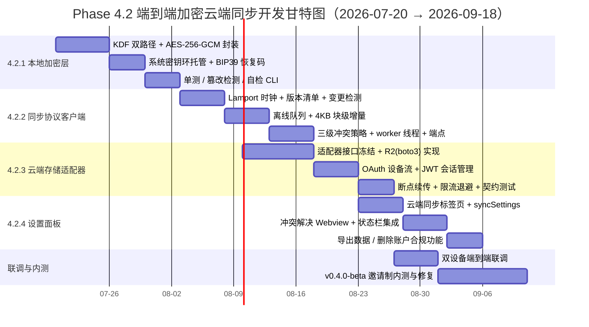

# Remember Me — Phase 4.2 云端同步开发路线图

**文档版本**: v1.0
**日期**: 2026-07-18
**对应架构**: `docs/design/cloud-sync-architecture-2026-07-16.md`（v1.0，已评审接受）
**对应需求**: PRD §4.2 云端同步 Pro 版 / §7 Phase 4 里程碑
**任务来源**: `plan/iteration-2026-07-18.md` 任务 D2（P2）
**编制**: 开发团队（文档与工具工程师）

---

## 1. 目标与范围

### 1.1 目标

基于 2026-07-16 已接受的云端同步架构，落地 **端到端加密（E2EE）的多设备记忆同步**，将架构文档转化为可执行的开发计划。核心原则不变：

1. **隐私优先**：服务端仅存储密文，零知识架构，密钥本地生成、本地保管；
2. **透明可控**：延续项目"纯 JSON、用户完全掌控"的哲学，同步层不改变 `~/.remember-me/` 的明文本地存储形态，加密只发生在出站传输边界；
3. **增量高效**：4KB 块级哈希增量同步、Lamport 时间戳冲突检测、离线可编辑；
4. **渐进交付**：四个里程碑（4.2.1 → 4.2.4）各自可独立验收，对应架构文档 §8 的 v0.4.0-alpha（2026-08）→ v0.4.0-beta（2026-09）→ v0.4.0（2026-10）发布节奏。

### 1.2 范围界定

| 范围内（Phase 4.2） | 范围外（后续阶段） |
|---------------------|---------------------|
| 本地加密层（KDF + AES-256-GCM + 密钥托管） | 团队协作共享记忆（v0.5.0） |
| 同步协议客户端（Lamport 版本、增量、冲突） | 多区域存储 / 企业版 MinIO 私有化（v0.6.0） |
| 云端存储适配器（Cloudflare R2，S3 兼容） | 自建同步服务端实现（本阶段复用 R2 对象存储 + 元数据索引服务） |
| VS Code 设置面板（账号、同步状态、冲突 UI） | 记忆质量分析、付费系统接入（PRD Phase 4 其他条目） |

**边界说明**：本阶段云端形态 = Cloudflare R2 密文桶 + 轻量元数据索引服务（仅存 `FileVersion` 清单，不接触明文与密钥），与架构文档 §3.1 一致。元数据索引服务本身的服务端工程列为 4.2.3 的"接口对齐"交付物，其完整实现不在本仓库范围内。

---

## 2. 技术选型决策

### 2.1 加密库：`cryptography` vs `pycryptodome`

| 维度 | `cryptography`（PyCA） | `pycryptodome` |
|------|------------------------|----------------|
| 维护方与安全记录 | PyCA 团队，OpenSSL 后端，经多次第三方安全审计 | PyCrypto 的 fork 继承者，C 扩展自行维护，历史包袱较重 |
| AES-256-GCM API | `hazmat.primitives.ciphers.aead.AESGCM` 高层 AEAD 封装，nonce/tag 不易误用 | `Cipher.new(MODE_GCM)` 底层 API，IV/tag/AAD 需手工拼装，误用面大 |
| KDF 支持 | 内置 `PBKDF2HMAC` / `HKDF` / `Scrypt` | 内置 `PBKDF2` / `HKDF` / `scrypt` |
| Argon2id | 需搭配 `argon2-cffi`（官方推荐组合） | 同样不支持，也需 `argon2-cffi` |
| 性能 | OpenSSL AES-NI 硬件加速，吞吐高 | 纯 C 实现，AES-GCM 吞吐一般低于 OpenSSL |
| Windows 打包 | 官方 wheel 静态链接 OpenSSL，免编译安装 | 提供预编译 wheel；与 PyInstaller 兼容性口碑较好 |
| 许可证 | Apache-2.0 / BSD 双许可，企业友好 | BSD / Public Domain |
| 项目契合度 | **07-16 架构文档 §2.3 示例代码已按 `AESGCM` 写好，§6 风险表明确"使用 cryptography，备选 libsodium"** | 与已定架构不一致，无增量收益 |

**结论：选用 `cryptography`（≥ 42.x），搭配 `argon2-cffi`。**

决定性理由（按权重排序）：

1. **架构一致性**：07-16 架构文档 §2.3 的加密代码示例直接以 `cryptography.hazmat.primitives.ciphers.aead.AESGCM` 编写，§6 风险表亦将其列为首选；选型结论必须与已评审架构保持一致，避免重新评审成本；
2. **防误用设计**：AEAD 高层 API 将 IV/tag/AAD 处理收敛到 `encrypt(nonce, data, aad)` 单一调用，显著降低 GCM nonce 复用这类致命错误的概率；
3. **安全供应链**：OpenSSL 后端 + 活跃审计 + AES-NI 硬件加速，`argon2-cffi` 为 Argon2id 事实标准实现，组合覆盖架构文档 §2.1 的双 KDF 路径（PBKDF2 兜底 / Argon2id 高配）。

`pycryptodome` 仅在出现极端打包兼容问题（如未来 PyInstaller 单文件分发受阻）时作为降级备选，当前不引入。

### 2.2 HTTP 客户端：`httpx` vs `aiohttp`

| 维度 | `httpx` | `aiohttp` |
|------|---------|-----------|
| 编程模型 | **同步 + 异步双 API，接口一致** | 仅异步 |
| 与现有代码契合度 | engine 当前为 stdlib `http.server` + `threading` 同步模型（`server.py` 的 `_RequestHandler` / 后台预加载线程），同步 API 可零改造接入，未来再平滑切 async | 强制 async，需在 worker 线程内手工跑事件循环，或对 engine 做全量异步重构，风险大 |
| HTTP/2 | 支持（对 R2/S3 分块上传有实际收益） | 仅 HTTP/1.1 |
| API 人体工学 | requests 风格，学习成本接近零 | `ClientSession` 生命周期需手工管理，忘关 session 会泄漏 connector |
| 测试支持 | `MockTransport` 注入，离线单测容易 | 需 `pytest-aiohttp` 等配套夹具 |
| 超时/重试控制 | 细粒度 per-request timeout 配置 | 支持但默认配置较绕 |
| 依赖链 | `httpcore` + `anyio`，轻 | `multidict` / `yarl` / `frozenlist`，较重 |
| 附带能力 | 纯客户端 | 含 web server 框架（本项目用不到，属冗余） |

**结论：选用 `httpx`（≥ 0.27）。**

决定性理由：

1. **架构匹配**：同步 API 直接嵌入 `server.py` 现有的 threading 模型（与 `_preload_vector_index` 后台线程同构的 `_sync_worker` 线程），不触发 engine 异步化重构；双 API 设计保留未来平滑迁移 async 的余地；
2. **协议收益**：HTTP/2 多路复用对 4KB 块级增量同步的高频小请求场景有明显延迟收益；
3. **可测试性**：`MockTransport` 允许在无网络环境下对同步协议客户端做全量契约测试，契合 4.2.2 的验收标准。

`aiohttp` 的异步 server 能力本项目完全用不到，其强制 async 模型反而构成集成负担，排除。

### 2.3 其他关键依赖

| 依赖 | 用途 | 选型理由 |
|------|------|----------|
| `argon2-cffi` ≥ 23.x | Argon2id 主密钥派生（架构 §2.1 高配路径：64MB 内存硬度，3 次遍历） | Argon2 事实标准绑定；低端设备自动降级 `cryptography` 内置 PBKDF2（100,000 迭代） |
| `keyring` ≥ 25.x | 主密钥系统级托管：Windows Credential Locker（DPAPI）/ macOS Keychain / Linux libsecret | 跨平台密钥环统一抽象，架构 §2.1"操作系统密钥链"的落地组件 |
| `mnemonic` ≥ 0.21 | BIP39 12 词恢复码（架构 §6 风险表"密钥丢失缓解"） | BIP39 标准参考实现，词表完备，支持熵→助记词→种子双向转换 |
| `boto3` ≥ 1.34 | S3 兼容对象存储访问：Cloudflare R2（本阶段）→ 未来阿里云 OSS / AWS S3 切换 `endpoint_url` 即可 | SigV4 签名、分块上传、断点续传的成熟实现；与架构 §4"多后端可迁移"策略一致 |
| `tenacity` ≥ 8.x | 上传/下载指数退避重试、限流响应 | 轻量声明式重试，避免手写退避状态机 |
| `PyJWT` ≥ 2.8 | 客户端 JWT 解析与过期预判（OAuth 2.0 会话） | 仅客户端解码/校验，无服务端签名需求，体积小 |

**依赖隔离**：以上全部归入 `packages/memory-engine/pyproject.toml` 新增的 `[project.optional-dependencies]` `sync` 分组，开源版（本地 JSON）用户零新增依赖，延续现有 `minimal` / `dev` / `benchmark` 分组惯例：

```toml
[project.optional-dependencies]
sync = [
    "cryptography>=42.0",
    "argon2-cffi>=23.1",
    "keyring>=25.0",
    "mnemonic>=0.21",
    "httpx>=0.27",
    "boto3>=1.34",
    "tenacity>=8.2",
    "PyJWT>=2.8",
]
```

---

## 3. 里程碑拆分

### 3.1 总览

| 里程碑 | 名称 | 时间窗 | 预估工时 | 对应版本 |
|--------|------|--------|----------|----------|
| 4.2.1 | 本地加密层 | 2026-07-20 → 2026-07-31（2 周） | 56 h | v0.4.0-alpha 核心 |
| 4.2.2 | 同步协议客户端 | 2026-08-03 → 2026-08-21（3 周） | 96 h | v0.4.0-alpha 收尾 |
| 4.2.3 | 云端存储适配器 | 2026-08-10 → 2026-08-28（2.5 周，与 4.2.2 部分并行） | 72 h | v0.4.0-beta 核心 |
| 4.2.4 | 设置面板 | 2026-08-24 → 2026-09-04（2 周） | 56 h | v0.4.0-beta 收尾 |
| — | 端到端联调 + 邀请制内测 | 2026-09-07 → 2026-09-18（2 周） | 48 h | v0.4.0-beta 发布 |
| — | GA 发布 | 2026-10 | — | v0.4.0 |

合计 ≈ 328 h ≈ 41 人日（按 1 名 Python 工程师 + 0.5 名 TypeScript 工程师配置，周期 9 周）。

### 3.2 里程碑 4.2.1 本地加密层

**目标**：实现架构文档 §2 的完整本地加密能力——主密钥派生、AES-256-GCM 文件级加解密、系统密钥环托管、BIP39 恢复码。纯本地功能，不触网，可独立验收。

**交付物**：

| 交付物 | 说明 |
|--------|------|
| `packages/memory-engine/src/memory_engine/crypto/__init__.py` | 加密包入口 |
| `crypto/kdf.py` | `derive_master_key(passphrase, salt, method)`：PBKDF2-SHA256（100k 迭代）/ Argon2id（64MB, 3 遍历）双路径；`derive_subkeys()` 按架构 §2.1 派生 DEK + MK |
| `crypto/cipher.py` | `encrypt_file()` / `decrypt_file()`：AES-256-GCM，12 字节随机 IV，AAD = `filepath:version`，直接采用架构 §2.3 的函数签名 |
| `crypto/keystore.py` | `KeyStore` 抽象：`keyring` 后端（Windows Credential Locker / macOS Keychain / libsecret）+ 无桌面环境降级（口令保护的加密密钥文件） |
| `crypto/recovery.py` | BIP39 12 词恢复码生成与密钥重建 |
| `tests/crypto/` | 加解密 round-trip、篡改检测（改 1 bit 密文/AAD 必抛 `InvalidTag`）、KDF 双路径等价性、恢复码重建一致性 |
| CLI 自检 | `remember-me-crypto selftest`（新增 `pyproject.toml` scripts 条目） |

**预估工时**：56 h（设计 8 h / 实现 28 h / 测试 12 h / 文档 8 h）

**验收标准**：

1. 架构 §2.3 的 `encrypt_file`/`decrypt_file` 示例语义 100% 落地，round-trip 测试全绿；
2. 密文或 AAD 任意篡改 → 解密抛认证错误，不返回明文；
3. 同一明文两次加密 → IV 不同、密文不同（IV 随机性验证）；
4. Windows 环境下主密钥可写入/读回 Credential Locker，进程重启后免密恢复；
5. 恢复码可完整重建主密钥（跨进程、跨设备模拟）；
6. `mypy --strict` 0 错误；该模块 pytest 覆盖率 ≥ 90%。

### 3.3 里程碑 4.2.2 同步协议客户端

**目标**：实现架构 §3 的同步协议客户端——Lamport 版本清单、4KB 块级变更检测、离线队列、三级冲突解决策略，并以 engine 后台线程形态运行。本里程碑的存储后端先打桩（内存/本地目录 fake），真实云端在 4.2.3 接入。

**交付物**：

| 交付物 | 说明 |
|--------|------|
| `memory_engine/sync/__init__.py` | 同步包入口 |
| `sync/lamport.py` | `LamportClock`：`tick()` / `merge()`；`(lamport, deviceId)` 字典序比较，对应架构 §3.2 |
| `sync/manifest.py` | `FileVersion` 清单（`filepath / lamport / deviceId / contentHash / modifiedAt`）的读写与 diff 计算，持久化于 `~/.remember-me/.sync/manifest.json` |
| `sync/chunker.py` | 4KB 块级 SHA-256 哈希树，变更块识别（架构 §3.4） |
| `sync/queue.py` | 离线队列：`~/.remember-me/.sync/queue/*.json`（JSONL 追加，延续透明 JSON 哲学），容量上限 + FIFO 重放 |
| `sync/conflict.py` | 三级策略引擎：LWW（默认）/ 手动合并标记（`profile.json`、`context.json`）/ 追加合并（`conversations/*.json`，架构 §3.3） |
| `sync/worker.py` | `_sync_worker` 后台线程：周期 tick → 变更检测 → 出队上传/下载；与 `server.py` 既有 `_preload_vector_index` 线程同构，复用 `_RequestHandler._shutdown_event` 优雅退出 |
| `server.py` 新增端点 | `POST /sync/now`、`GET /sync/status`、`GET /sync/conflicts`、`POST /sync/resolve`，复用 `_send_json` / `_read_json_body` 与 do_GET/do_POST 路由表 |
| `tests/sync/` | Lamport 收敛性、断网重放、三策略冲突矩阵、`httpx.MockTransport` 契约测试 |

**预估工时**：96 h（设计 12 h / 实现 52 h / 测试 24 h / 文档 8 h）

**验收标准**：

1. 双设备模拟（两个数据目录 + fake 后端）：并发修改同一文件，LWW 收敛结果确定且两设备一致；
2. 断网状态下连续编辑 50 个文件 → 全部入队；恢复网络后队列按序重放，无丢失、无重复上传；
3. `profile.json` 冲突 → 状态端点返回 `conflict_pending`，不自动覆盖；`conversations/*.json` 冲突 → 双版本保留并标记"多设备同步副本"；
4. 大文件（≥ 1MB）二次同步仅传输变更块（传输字节数 < 全量 20%，按哈希树断言）；
5. 队列容量达上限（默认 500 条）触发告警日志且不崩溃、不丢最新变更（新变更优先合并入队）；
6. `mypy --strict` 0 错误；该模块 pytest 覆盖率 ≥ 85%。

### 3.4 里程碑 4.2.3 云端存储适配器

**目标**：实现架构 §4 推荐方案——Cloudflare R2（S3 兼容）密文桶 + OAuth 2.0 设备流认证 + JWT 会话管理，替换 4.2.2 的 fake 后端，跑通真实上云链路。

**交付物**：

| 交付物 | 说明 |
|--------|------|
| `sync/storage/base.py` | `CloudStorageAdapter` 抽象接口：`list_versions()` / `upload(filepath, ciphertext, version)` / `download(filepath)` / `delete_all()`，对应架构 §7 服务端 API 预览 |
| `sync/storage/r2.py` | R2 实现：`boto3` + `endpoint_url` 指向 R2，SigV4，分块 multipart 上传 + 断点续传，`tenacity` 指数退避 |
| `sync/auth.py` | OAuth 2.0 Device Authorization Flow（VS Code 内打开浏览器授权）+ JWT 本地缓存、过期预判刷新（`PyJWT`）；refresh token 存 VS Code `SecretStorage`，engine 侧不落盘 |
| 元数据索引服务接口契约 | `docs/design/sync-server-api-2026-08.md`：`GET/POST /v1/files`、`GET /v1/files/:id`、`DELETE /v1/account` 的请求/响应 schema（对齐架构 §7；服务端实现不在本仓库） |
| 配置项 | `~/.remember-me/.sync/config.json`：endpoint、region、桶名、设备 ID（首次启动生成 UUID） |
| `tests/storage/` | moto/localstack 或 stub 下的 R2 契约测试；限流（429）与 5xx 重试行为测试 |

**预估工时**：72 h（设计 8 h / 实现 40 h / 测试 16 h / 文档 8 h）

**验收标准**：

1. 真实 R2 桶端到端：`sync/now` 触发后，本地变更加密上传，第二设备下载解密出一致明文；
2. 服务端对象全为密文（人工抽查 + 自动断言：桶内任何对象不可解析为 JSON 明文）；
3. 网络中断恢复：multipart 上传中途断网 → 恢复后续传成功，不产生重复/截断对象；
4. 429/5xx 按指数退避重试，连续失败 ≥ 6 次进入冷却并在 `/sync/status` 暴露降级状态；
5. refresh token 过期 → 自动走设备流重新授权，用户仅需一次浏览器确认；
6. 适配器接口留有阿里云 OSS / AWS S3 的 `endpoint_url` 切换路径（配置级，无需改代码）。

### 3.5 里程碑 4.2.4 设置面板

**目标**：在 VS Code 插件侧完成云同步的用户可见能力——账号绑定、同步状态可视化、冲突解决 UI、数据导出与账户删除（架构 §5.2 合规要求）。

**交付物**：

| 交付物 | 说明 |
|--------|------|
| `src/ui/webview/settingsPanel.ts` 扩展 | 现有三标签页（画像/项目/风格）新增第四标签页"云端同步"：账号绑定入口、同步开关、最近同步时间、冲突列表入口 |
| `src/utils/syncSettings.ts` | 同步配置读写，完全仿照 `src/utils/searchSettings.ts` 的 `getSearchSettings()` 单例模式（`read()` / `setMode()` 风格 API） |
| `src/utils/engineClient.ts` 扩展 | `EngineClient` 新增 `syncNow()` / `syncStatus()` / `getConflicts()` / `resolveConflict()` 方法，沿用 `requestWithTimeout` 与安全默认值约定（网络异常返回安全默认、不抛异常） |
| `src/extension.ts` 新命令 | `rememberMe.syncNow`、`rememberMe.openSyncSettings`、`rememberMe.resolveConflict`、`rememberMe.exportSyncData`、`rememberMe.deleteCloudAccount`，全部走既有 `runWithErrorHandler` 包装并在 `registerCommands()` 注册 |
| 状态栏集成 | `StatusBarManager.updateState()` 复用（参照现有 `semanticLoading` 轮询模式）：同步中 spinner / 离线降级 / 冲突待处理角标 |
| 冲突解决 Webview | 复用 `BaseWebview` 抽象（`src/ui/webview/baseWebview.ts`）：左右差异对比，"保留本机 / 保留云端 / 手动合并"三选 |
| 合规功能 | "导出全部数据"（加密 ZIP 下载）与"删除账户"（二次确认 → 级联删除云端密文与元数据），对应架构 §5.2 |
| `package.json` | `contributes.commands` 与 `contributes.configuration`（`rememberMe.sync.enabled`、`rememberMe.sync.intervalMinutes` 等）同步声明 |

**预估工时**：56 h（设计 8 h / 实现 30 h / 测试 10 h / 文档 8 h）

**验收标准**：

1. 新标签页遵循既有 Webview 主题适配（明暗模式），不引入外部脚本（沿用 `vscode-resource:` 协议约束）；
2. 账号绑定全流程 ≤ 5 步点击；解绑后本地明文数据完整保留、仅停止同步；
3. 冲突出现时状态栏 10 秒内出现角标，点击直达冲突解决面板；解决后双端收敛；
4. "删除账户"二次确认后，云端对象与元数据清空（R2 桶列举为空 + 索引服务 404），本地数据不动；
5. `tsc -p ./ --noEmit` 0 错误；新增模块 npm test 用例全绿（沿用现有 333 项测试基线增量执行）。

---

## 4. 甘特图与依赖关系

### 4.1 Mermaid 甘特图



### 4.2 依赖关系说明

```
4.2.1 本地加密层
   │
   ▼
4.2.2 同步协议客户端 ──（协议/manifest 接口于 08-10 冻结）──► 4.2.3 云端存储适配器
   │                                                              │
   │                                                              ▼
   │                                                     OAuth 设备流可用（m32）
   │                                                              │
   ▼                                                              ▼
冲突状态端点（/sync/conflicts, m23）────────────────────────► 4.2.4 设置面板
                                                                 │
4.2.2 + 4.2.3 真实链路就绪（m33）◄───────────────────────────────┘
   │
   ▼
双设备端到端联调（m51） → v0.4.0-beta 内测（m52） → v0.4.0 GA（2026-10）
```

关键路径与并行点：

1. **严格串行**：4.2.1 → 4.2.2。同步协议上传的每一份载荷都必须经加密层处理，无加密层则无同步；
2. **接口冻结点（2026-08-10）**：4.2.2 的 `manifest.py` / `CloudStorageAdapter` 接口在 4.2.2 开工一周后冻结，4.2.3 据此并行开工（此时 4.2.2 剩余工作仅为冲突策略与端点，不影响接口）；
3. **UI 并行点（m32 完成 ≈ 2026-08-21）**：OAuth 设备流可用后，4.2.4 设置面板并行开工，依赖 4.2.2 的 `/sync/conflicts`、`/sync/status` 端点契约（已随 m23 冻结）；
4. **联调前置**：端到端联调（m51）要求 4.2.2 全量完成 + 4.2.3 真实 R2 链路就绪（m33），4.2.4 可在联调期间并行收尾；
5. **缓冲**：每个里程碑预留 ~15% 工时缓冲已计入预估；若 4.2.1 延期，4.2.3 的 R2 适配器开发不受影响（可先用 fake 后端与 fake 认证推进），关键路径仅 4.2.1 → 4.2.2 → m51。

---

## 5. 与现有代码的集成点

> **勘误说明**：任务描述中的 `packages/vscode-extension/src/utils/storage.ts` 实际位于 `packages/vscode-extension/src/memory/storage.ts`；`src/utils/` 下持有 `engineClient.ts`、`searchSettings.ts` 等。以下集成点全部取自当前代码真实符号。

### 5.1 插件侧：`src/memory/storage.ts`

| 真实符号 | 集成方式 |
|----------|----------|
| `class JsonStorage`（`read` / `write` / `merge` / `exists` / `delete` / `listDir` / `readAllInDir` / `backup` / `getBasePath`） | **变更感知**：新增可选 `onFileChanged` 回调钩子，`write()` / `merge()` 成功后触发，供同步层入队；`listDir` / `readAllInDir` 直接复用为全量变更扫描的数据源；`backup()` 逻辑不变（`.backups/` 目录不纳入同步范围） |
| `getStorage()` 单例 | 同步层通过同一单例读取 `getBasePath()`（`~/.remember-me`），保证与 engine 侧 `cli.DEFAULT_DATA_DIR` 路径一致 |
| 文件布局（`profile.json`、`projects/{name}/context.json`、`projects/{name}/conversations/*.json`） | 直接映射架构 §2.2 的单文件级加密粒度表；`templates/` 与用户自定义模板默认**不同步**（本地资产），列入 `.syncignore` |

备选方案（若不愿改动 `JsonStorage`）：插件激活时用 `vscode.workspace.createFileSystemWatcher` 监听 `~/.remember-me/**/*.json`，同样驱动入队。优先采用回调钩子方案（少一层文件系统事件去抖，Windows 下 watcher 事件有合并/丢失先例）。

### 5.2 插件侧：`src/extension.ts`

| 真实符号 | 集成方式 |
|----------|----------|
| `activate(context)` | 仿照现有 `EngineClient` 健康检查 + 语义模型轮询段（`semanticPollInterval` 模式）：同步开启时启动 `GET /sync/status` 周期轮询，驱动状态栏 spinner/角标 |
| `registerCommands(context, storage)` | 注册 5 个新命令（见 3.5）：`rememberMe.syncNow` 等，全部经既有 `runWithErrorHandler` 包装，进度提示复用 `withProgress` |
| `deactivate()` | 仿照 A1-修复后的 `semanticPollInterval` 清理模式：同步轮询 interval 提升为模块级变量并在 `deactivate()` 中 `clearInterval`，防止内存泄漏（07-17 已踩过的坑，直接沿用修复范式） |
| `checkFirstRun()` | 不动；云同步绑定入口仅放设置面板与 `rememberMe.showMenu` 菜单项，不打搅首次引导 |
| `context.secrets`（VS Code `SecretStorage`） | OAuth refresh token 与设备 ID 的托管位置，与 ARCHITECTURE.md 安全节"API 密钥使用 SecretStorage"一致 |

### 5.3 插件侧：`src/utils/engineClient.ts`

| 真实符号 | 集成方式 |
|----------|----------|
| `class EngineClient`（`healthCheck` / `extract` / `search` / `semanticSearch` / `hybridSearch` / `buildSemanticIndex`） | 新增 `syncNow()` / `syncStatus()` / `getConflicts()` / `resolveConflict()`，签名风格与现有方法一致；**沿用既有约定：所有网络异常捕获后返回安全默认值并记 warn 日志，不向 UI 抛异常** |
| `requestWithTimeout()`（private） | 直接复用；同步状态轮询沿用 `timeoutMs = 3000` 默认；`syncNow` 等长操作单独放宽超时（构造参数已支持） |
| `SemanticSearchResult` 等 interface | 新增 `SyncStatus` / `SyncConflict` interface，保持文件内既有类型导出风格 |

### 5.4 引擎侧：`packages/memory-engine/`

| 真实符号 | 集成方式 |
|----------|----------|
| `server.py::_RequestHandler.do_GET` / `do_POST` 路由表 | 新增 4 条路由（`/sync/now`、`/sync/status`、`/sync/conflicts`、`/sync/resolve`），复用 `_send_json` / `_read_json_body`；未知端点 404 行为不变 |
| `server.py::MemoryEngineServer.run()` | 在 `_preload_vector_index` 后台线程旁启动 `_sync_worker` daemon 线程；**复用 `_RequestHandler._shutdown_event`** 实现优雅退出（A1-修复后已具备可中断轮询范式，`_sync_worker` 直接套用）；`finally` 段补充同步队列落盘 flush |
| `server.py::_RequestHandler.get_vector_index()` | 其"类级懒加载 + 异常降级返回 None"模式作为 `get_sync_client()` 的模板；同步不可用时端点返回 503 + 友好错误（与语义搜索降级行为对齐，插件侧 `EngineClient` 已有对应处理惯例） |
| `server.py::_handle_health` | 响应体新增 `sync_ready` / `sync_status` 字段（沿用 `semantic_ready` 的先例；旧版插件读到 `undefined` 时按 A1-修复确立的"安全降级为不可用"语义处理，天然向后兼容） |
| `cli.py::DEFAULT_DATA_DIR`（`~/.remember-me`）/ `_data_dir()`（`REMEMBER_ME_DATA_DIR` 环境变量覆盖） | 同步产物（`manifest.json`、`queue/`、`config.json`）统一置于 `{data_dir}/.sync/`，跟随同一环境变量，测试隔离零成本 |
| `SemanticSearchError`（`vector_index.py`） | 新增 `SyncError` 异常族，沿用"业务异常 → 503 降级"的分层捕获语义；`get_sync_client` 兜底 `Exception`（问题 #1 教训：运行时异常不得穿透 HTTP 处理器） |
| `pyproject.toml` `[project.optional-dependencies]` | 新增 `sync` 分组（见 §2.3），开源版安装零新增依赖 |

---

## 6. 风险与缓解

| 风险 | 可能性 | 影响 | 缓解措施 |
|------|--------|------|----------|
| **主密钥丢失**（重装系统 / 换设备未导出恢复码） | 中 | 极高（云端数据永久不可解密） | ① 首次启用强制展示 BIP39 12 词恢复码并要求"我已离线保存"勾选才能继续；② `crypto/recovery.py` 支持恢复码重建；③ 设置面板提供"重新查看恢复码"（需重新输入口令） |
| **Windows 凭据存储差异**（Credential Locker 容量上限 2.5KB/条、域控机器策略限制、无 GUI 的 SSH/Server Core 会话） | 中 | 高 | ① 主密钥 ≤ 32B，远低于容量上限；② `keyring` 失败时降级为"口令保护的加密密钥文件"（`~/.remember-me/.sync/keystore.enc`，PBKDF2 + AES-GCM），并在文档明示降级路径的安全等级差异；③ CI 增加无桌面环境的降级路径测试 |
| **冲突合并错误导致记忆损坏** | 中 | 高 | ① 默认 LWW 仅自动应用于非关键文件；`profile.json` / `context.json` 一律转人工（§3.3 策略表）；② 自动覆盖前强制 `JsonStorage.backup()` 先落本地备份（复用现有 `.backups/` 机制，保留 20 版）；③ 追加合并的对话副本带"多设备同步副本"标记，可一键清理 |
| **离线队列膨胀 / 重放风暴** | 中 | 中 | ① 队列上限 500 条，超限合并同文件变更（同一路径只留最新版本）；② 重放限速 + 指数退避，避免恢复瞬间打爆 R2；③ `/sync/status` 暴露队列深度，UI 提示"尚有 N 项待同步" |
| **Lamport 时钟状态损坏**（`.sync/manifest.json` 被手改/损坏） | 低 | 高 | ① manifest 带 HMAC（MK 派生）自检，损坏即按"全新设备"重建并触发全量冲突比对，而非静默覆盖云端；② 记住项目用户是非技术人员——文档明确"不要手动编辑 `.sync/` 目录" |
| **OAuth refresh token 刷新竞态**（多窗口同时刷新） | 中 | 中 | ① 刷新操作单例化（进程内锁 + `SecretStorage` 写后读校验）；② 刷新失败保留旧 token 至其真正过期，期间降级只读同步 |
| **服务端元数据泄露**（文件路径、时间戳、设备 ID） | 低 | 中 | ① 元数据最小化：路径做 HMAC 处理（架构 §6 既定方针），索引服务不存明文路径；② 威胁模型写入用户文档，明确"服务端知道什么" |
| **大文件首次全量上传慢**（重度用户对话历史多） | 中 | 低 | ① 首传走 multipart 并行分块；② 4KB 哈希树保证后续增量；③ UI 首传期间显示进度与可取消 |
| **R2 供应商锁定 / 涨价** | 低 | 高 | `CloudStorageAdapter` 抽象 + `endpoint_url` 配置化（架构 §4 既定），OSS/S3 迁移仅需配置与签名验证切换 |
| **加密层拖累老设备**（Argon2id 64MB 内存硬度在低端机过慢） | 中 | 低 | ① 派生耗时 > 3s 时自动降级 PBKDF2 并记录（架构 §6 既定）；② 派生结果缓存于密钥环，日常使用零 KDF 开销 |
| **同步线程与预加载线程争抢启动资源** | 低 | 低 | `_sync_worker` 启动延迟错开（参照 `_preload_vector_index` 的可中断 0.1s 轮询范式），且同步 worker 默认等待 `sync_ready` 配置存在才启动 |

---

## 7. 验收标准表

### 7.1 里程碑验收汇总

| 里程碑 | 关键验收项 | 验证方式 |
|--------|------------|----------|
| 4.2.1 | 加解密 round-trip 全绿；篡改必抛错；IV 随机不重复；Windows Credential Locker 读写通过；恢复码可重建密钥；mypy --strict 0 错误；覆盖率 ≥ 90% | `pytest tests/crypto/` + Windows 实测 |
| 4.2.2 | 双设备 LWW 收敛一致；断网 50 文件重放无丢失；三策略冲突矩阵全过；增量传输 < 全量 20%；队列上限行为正确；覆盖率 ≥ 85% | `pytest tests/sync/`（fake 后端 + MockTransport） |
| 4.2.3 | 真实 R2 双设备端到端明文一致；云端抽查全密文；断网续传无重复对象；429/5xx 退避与冷却可见；token 续期一次授权完成 | 联调环境实测 + 契约测试 |
| 4.2.4 | 绑定 ≤ 5 步；冲突角标 ≤ 10s 出现；删除账户后云端清空、本地不动；tsc 0 错误；npm test 增量全绿 | VS Code 手动验证 + 自动化测试 |

### 7.2 Phase 4.2 整体验收（对应 v0.4.0 GA）

| 维度 | 标准 | 验证方式 |
|------|------|----------|
| 安全 | 服务端任何对象/元数据不含明文与明文路径；密钥不出设备（密钥环或加密密钥文件） | 云端对象抽查 + 代码审查 |
| 正确性 | 双设备任意交错编辑后最终一致；冲突三策略行为符合架构 §3.3 | 双设备矩阵测试（Windows ↔ macOS） |
| 性能 | 1000 文件首传 < 10 min（10 Mbps）；单文件增量同步 < 3 s；AES-GCM 吞吐 > 50 MB/s（AES-NI） | 基准脚本实测 |
| 可靠性 | 断网 24 h 编辑后恢复同步零丢失；进程强杀后队列可续 | 故障注入测试 |
| 合规 | 导出全部数据（加密 ZIP）可用恢复码离线解密；删除账户级联清空 | 手动走查 GDPR/PIPL 对照表（架构 §5.2） |
| 质量 | `mypy --strict` 0 错误（crypto/sync）；`tsc --noEmit` 0 错误；pytest + npm test 全绿；CI Python 3.12 矩阵通过 | CI + 命令行 |
| 兼容 | 开源版（未装 `sync` 依赖）所有既有功能与 333 项测试基线不回退 | 既有测试套件回归 |

---

## 8. 相关文档

- **架构依据**: `docs/design/cloud-sync-architecture-2026-07-16.md`（§2 加密、§3 同步协议、§4 存储选型、§8 版本里程碑）
- **需求**: `docs/PRD.md`（§4.2 Pro 版、§7 Phase 4）
- **现状**: `docs/ARCHITECTURE.md`、`reports/daily-2026-07-17.md`（问题 #1 教训：运行时异常兜底与降级路径）、`plan/iteration-2026-07-18.md`（任务 D2）
- **集成代码**: `packages/vscode-extension/src/memory/storage.ts`、`src/extension.ts`、`src/utils/engineClient.ts`、`packages/memory-engine/src/memory_engine/server.py`

---

**编制时间**: 2026-07-18
**编制者**: Remember Me 开发团队（文档与工具工程师）
